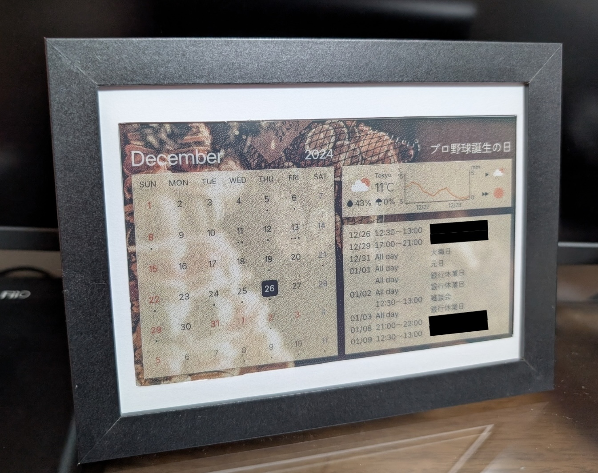
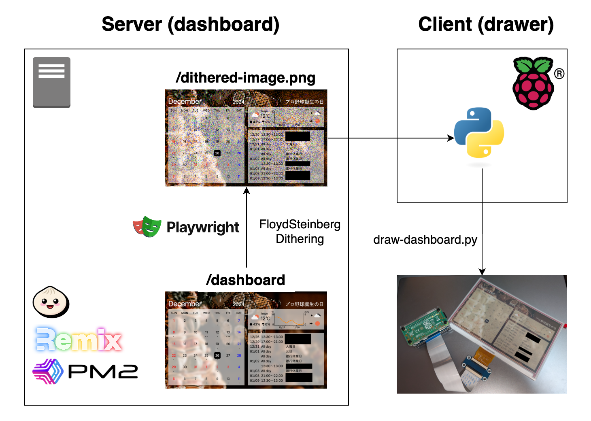

# epdash

Raspberry Pi Zero 2 と 7色描画可能な電子ペーパー Waveshare 7.3inch e-Paper HAT (F) を利用した電子ペーパーダッシュボードです

詳細は[カラー電子ペーパーを使った個人ダッシューボード作成 2024 その2 - Qiita](https://qiita.com/aoirohn/private/db8d52af4546fabbe032)を参照してください。

## 構成図

### 処理の流れ

1. 表示するダッシュボードをRemixを使ってWebページとして作成します
2. 作成したダッシュボードをplaywrightを利用して画像として取得します
3. ディザリングを行います
4. Raspberry Piにて画像を取得し、電子ペーパーに書き込みます

### サーバーについて

- Raspberry Pi Zero 2 ではスペックが足りないため、サーバー部分を別途用意する必要があります。
- Raspberry Pi 4/5などを利用するのであればServerとClientを1台のRaspberry Piに共通化できます。
